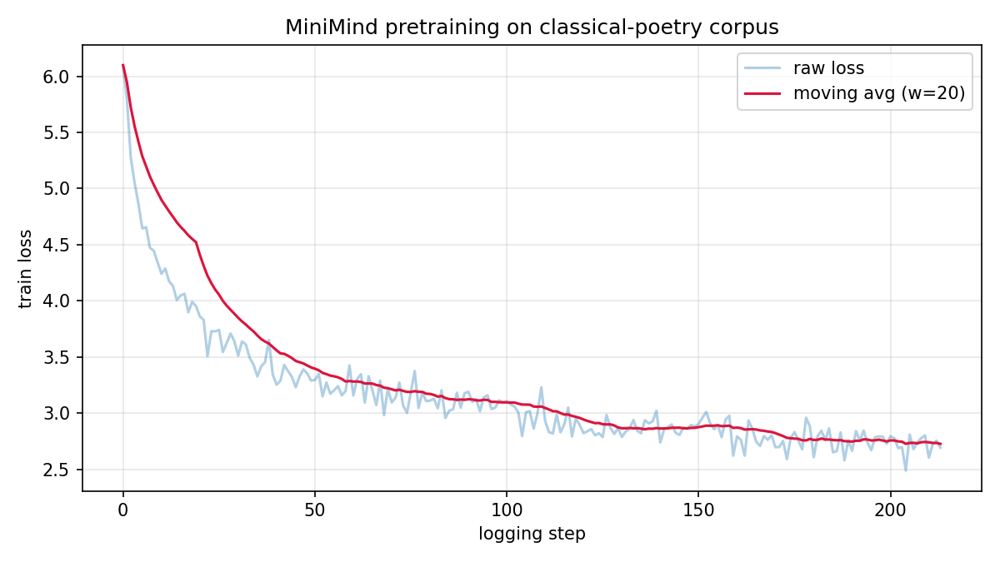
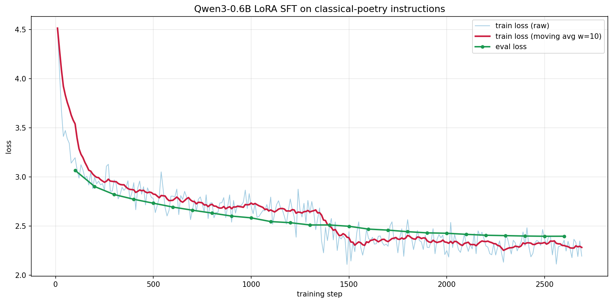
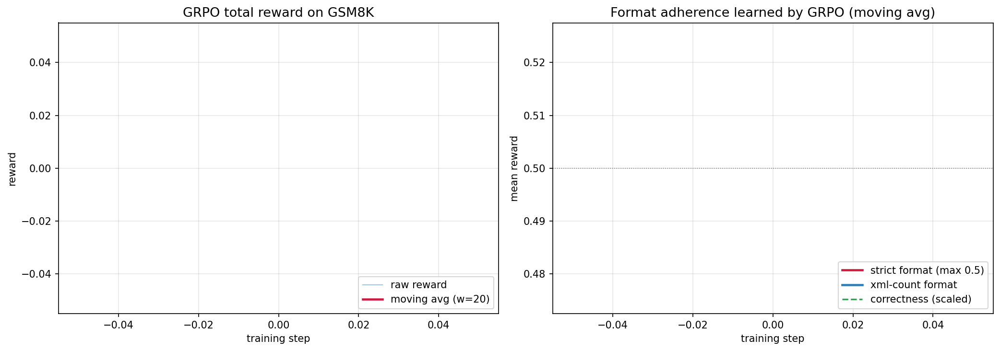

# 古典诗词大模型训练实践：从头预训练 · LoRA 微调 · GRPO 强化学习

在单张 24 GB 消费级 GPU 上完整复现大语言模型三阶段训练的开源项目。以**中国古典诗词**为领域主线，
覆盖「从零预训练 → 指令微调 → 强化学习后训练」，并在 GSM8K 数学推理上用 GRPO 复现可验证奖励
驱动的推理能力提升与反思式 **“Aha Moment”** 现象。

项目包含三个相互独立的算例：

- **算例一 · 从头预训练** —— 用 [MiniMind](https://github.com/jingyaogong/minimind) 在 [chinese-poetry](https://github.com/chinese-poetry/chinese-poetry) 语料上从随机初始化训练一个约 64M 参数的 Transformer 解码器。
- **算例二 · 指令微调** —— 基于 [unsloth](https://github.com/unslothai/unsloth) + LoRA 对 Qwen3-0.6B 做参数高效微调，构建古诗词续写 / 默写 / 出处问答能力。
- **算例三 · GRPO 后训练** —— 在 GSM8K 上以五项规则奖励对 Qwen3-0.6B 做组相对策略优化（GRPO），观察推理准确率提升与反思涌现。

## 主要结果

| 算例 | 模型 | 任务 / 数据 | 关键指标 |
| --- | --- | --- | --- |
| 一 · 从头预训练 | MiniMind（~64M） | chinese-poetry | 训练损失 6.1 → **2.7**（困惑度 ≈ 15） |
| 二 · LoRA SFT | Qwen3-0.6B | 古诗词指令集（21.6k） | 验证损失 3.07 → **2.40**，无过拟合 |
| 三 · GRPO | Qwen3-0.6B | GSM8K | 准确率 38.0% → **59.5%**（+21.5 pp，贪心解码） |

各算例的损失 / 奖励曲线与详细分析见下文「算例与分析」。

## 项目结构

```
├── data/                       # 语料与指令集构建
│   ├── download_poetry.sh      # 拉取 chinese-poetry 原始语料
│   ├── build_pretrain_corpus.py  # → data/out/pretrain_guwen.jsonl
│   └── build_sft_dataset.py    # → data/out/sft_guwen_{train,val}.jsonl
├── task1_pretrain_minimind/    # 算例一：从头预训练（详见该目录 README）
│   └── plot_loss_from_log.py
├── task2_sft_qwen0.6b/         # 算例二：LoRA SFT
│   ├── train_sft_unsloth.py
│   └── infer_compare.py        # 微调前后同题对比 → compare.md
├── task3_grpo_qwen0.6b/        # 算例三：GRPO + 评测
│   ├── train_grpo_unsloth.py   # 规则奖励（正确性 + 格式）
│   └── eval_gsm8k.py           # 前后准确率 + 反思片段扫描
├── assets/                     # README 配图
├── requirements.txt
└── setup_autodl.sh             # 一键安装依赖并下载基座模型
```

## 安装

```bash
pip install -r requirements.txt
```

`unsloth / trl / vLLM` 迭代较快，建议按各自文档选择与本机 CUDA 匹配的版本；
若 vLLM 安装困难，算例三可加 `--no_vllm` 回退到纯 transformers 采样。
HuggingFace 访问已在脚本内默认走镜像（`HF_ENDPOINT=hf-mirror.com`）。

## 数据准备

```bash
bash data/download_poetry.sh                              # 拉取原始诗词语料
python data/build_pretrain_corpus.py --max_samples 200000  # 预训练语料
python data/build_sft_dataset.py                          # 续写/默写/出处问答 指令集
```

构建脚本会完成繁简转换与清洗，产出与下游训练对齐的 `data/out/*.jsonl`。

---

## 算例与分析

### 算例一 · 从头预训练（MiniMind, ~64M）

在 chinese-poetry 上从随机初始化预训练一个约 64M 的 Transformer 解码器
（hidden 768 / 8 层，RMSNorm + RoPE + SwiGLU）。完整步骤见
[`task1_pretrain_minimind/README.md`](task1_pretrain_minimind/README.md)，核心命令：

```bash
git clone --depth 1 https://github.com/jingyaogong/minimind.git
cd minimind/trainer && python train_pretrain.py \
    --data_path <repo>/data/out/pretrain_guwen.jsonl \
    --epochs 2 --batch_size 32 --learning_rate 5e-4 \
    --max_seq_len 340 --hidden_size 768 --num_hidden_layers 8
```



**分析。** 训练损失自约 6.1 平滑收敛至约 2.7（困惑度 ≈ 15），曲线前陡后平、无发散。
模型习得了五 / 七言的节奏切分与一定的对仗倾向，并掌握语料中“《标题》作者 + 正文”的结构格式；
受限于 64M 容量，其事实性较弱、易混搭名句——印证预训练阶段学到的是**语言形式与统计规律**，
而非可靠的事实知识。

### 算例二 · LoRA 指令微调（Qwen3-0.6B + unsloth）

以 Qwen3-0.6B 为基座，LoRA（$r=16$，作用于 `q/k/v/o` 与前馈投影）微调，
数据为自建的续写（9k）/ 默写（7k）/ 出处问答（6k）指令集，仅在回答 token 上计算损失。

```bash
python task2_sft_qwen0.6b/train_sft_unsloth.py       # 2 epoch · batch 16 · lr 2e-4
python task2_sft_qwen0.6b/infer_compare.py           # 微调前后同题对比 → compare.md
```



**分析。** 训练损失 4.52 → 2.19，验证损失 3.07 → 2.40 全程单调下降且无回升，
表明模型恰好充分收敛、未过拟合。但定性对比揭示一个值得注意的现象：
微调后在部分题目上的表观质量并未优于基座。归因有二，且均**非训练性问题**：
（1）原始语料中的编者注解（如“（见《全唐诗续拾》卷三四）”）未经清洗即作为目标答案，
模型忠实学到了“输出注解”的伪模式；（2）贪心解码下小模型出现复读退化。
这说明 **SFT 改变的是模型的“行为风格”而非“知识容量”**，且“损失下降 ≠ 生成质量提升”——
对小模型而言，数据清洗与解码策略与训练本身同等关键。

### 算例三 · GRPO 后训练（Qwen3-0.6B on GSM8K）

在 GSM8K 上用 GRPO 进行强化学习后训练。奖励完全由程序自动核验，不可被 reward hacking：

| 奖励项 | 触发条件 | 分值 |
| --- | --- | --- |
| 正确性 | 抽取答案与标准答案数值相等 | +2.0 |
| 数值性 | 答案为合法数字 | +0.5 |
| 严格格式 | 匹配 `<reasoning>…</reasoning>\n<answer>…</answer>` | +0.5 |
| 宽松格式 | 出现两对标签 | +0.5 |
| 标签计数 | 每个正确标签 +0.125 | 0–0.5 |

```bash
python task3_grpo_qwen0.6b/train_grpo_unsloth.py     # 500 步 · G=8 · lr 5e-6
python task3_grpo_qwen0.6b/eval_gsm8k.py --n 200     # 前后准确率 + 反思片段扫描
```



**分析。** GRPO 将 GSM8K 贪心解码准确率从 38.0% 提升至 59.5%（+21.5 个百分点）。
训练过程与 DeepSeek-R1 的描述一致：**格式类奖励先快速饱和**（严格格式 0.24 → 0.47，上限 0.5），
**正确性奖励随后台阶式抬升**，平均回答长度自适应缩短（677 → 474 token），KL 散度稳步上升而未发散。
关键词扫描得到的反思候选中，存在完整成功的反思式解题（正确建立方程并求解）；
但小模型上的反思并不稳定，部分会退化为重复直至触发长度截断。
即字面意义的 **“Aha Moment”在 0.6B / 500 步设定下可涌现但脆弱**，
与模型规模和训练规模相关——这从反面印证了 R1 论文的核心观察。

---

## 结论

三个算例分别从预训练、监督微调、强化学习后训练三个层面，对现代 LLM 训练范式做了
可观察、可归因的小规模复现：（1）从零预训练验证了“数据 → 损失 → 生成形式”的因果链；
（2）LoRA 微调在指标上充分收敛，并暴露出“损失下降但生成质量受数据噪声与解码策略影响”的反差；
（3）GRPO 以可验证奖励显著提升了小模型的数学推理准确率，并复现了反思语言的涌现及其规模依赖性。
一个自然的延伸方向是将 GRPO 用于诗词格律本身——平仄、押韵与对仗同样是可程序化验证的奖励信号。

## 致谢与参考

- MiniMind · <https://github.com/jingyaogong/minimind>
- unsloth · <https://github.com/unslothai/unsloth>
- chinese-poetry · <https://github.com/chinese-poetry/chinese-poetry>
- Qwen3 · <https://github.com/QwenLM/Qwen3>
- GRPO：DeepSeekMath, arXiv:2402.03300 ｜ Aha Moment：DeepSeek-R1, arXiv:2501.12948 ｜ GSM8K, arXiv:2110.14168
